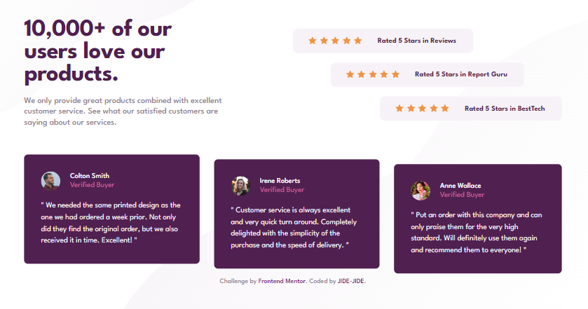

# Frontend Mentor - Social proof section solution

This is a solution to the [Social proof section challenge on Frontend Mentor](https://www.frontendmentor.io/challenges/social-proof-section-6e0qTv_bA). Frontend Mentor challenges help you improve your coding skills by building realistic projects. 

## Table of contents

- [Overview](#overview)
  - [The challenge](#the-challenge)
  - [Screenshot](#screenshot)
  - [Links](#links)
- [My process](#my-process)
  - [Built with](#built-with)
  - [What I learned](#what-i-learned)
  - [Useful resources](#useful-resources)
- [Author](#author)

## Overview

### The challenge

Users should be able to:

- View the optimal layout for the section depending on their device's screen size

### Screenshot

- Desktop view
  
- Mobile view
  

### Links

- Live Site URL: [Github pages](https://jide-jide.github.io/Social-proof-section/)

## My process

### Built with

- Semantic HTML5 markup
- CSS custom properties
- Flexbox
- CSS Grid
- Mobile-first workflow

### What I learned

In this project, i learned to  make use of a component based approach. This means creating individual components of a website and styling them instead of having everything on the page at once and styling.

### Useful resources

- [Svg as background image](https://www.svgbackgrounds.com/how-to-add-svgs-with-css-background-image/) - This helped me use svg as background image.

## Author

- Github - [Emmanuel](https://www.github.com/jide-jide)
- Frontend Mentor - [Emmanuel](https://www.frontendmentor.io/profile/jide-jide)
